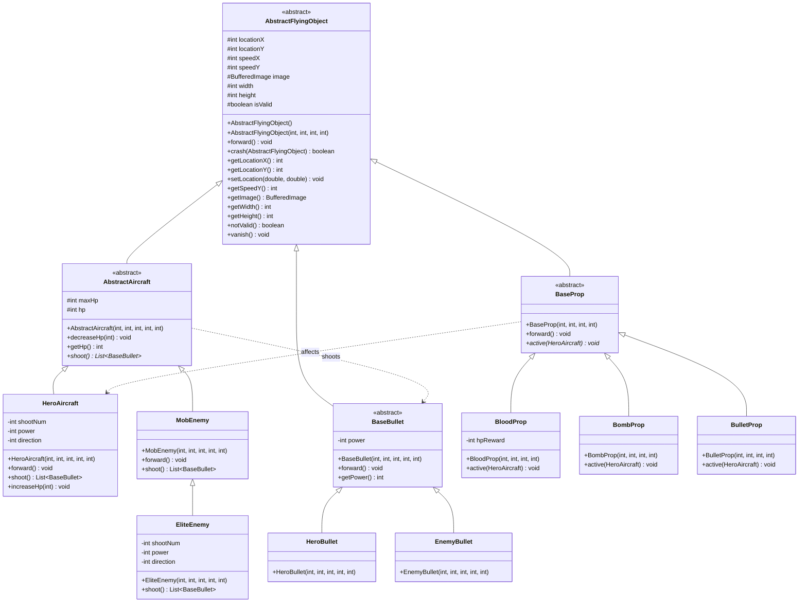
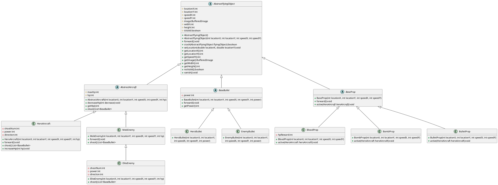

# AircraftWar

## 项目类图

### Mermaid 类图

```mermaid
classDiagram
    class AbstractFlyingObject {
        <<abstract>>
        #int locationX
        #int locationY
        #int speedX
        #int speedY
        #BufferedImage image
        #int width
        #int height
        #boolean isValid
        +AbstractFlyingObject()
        +AbstractFlyingObject(int, int, int, int)
        +forward() void
        +crash(AbstractFlyingObject) boolean
        +getLocationX() int
        +getLocationY() int
        +setLocation(double, double) void
        +getSpeedY() int
        +getImage() BufferedImage
        +getWidth() int
        +getHeight() int
        +notValid() boolean
        +vanish() void
    }

    class AbstractAircraft {
        <<abstract>>
        #int maxHp
        #int hp
        +AbstractAircraft(int, int, int, int, int)
        +decreaseHp(int) void
        +getHp() int
        +shoot() List~BaseBullet~*
    }

    class HeroAircraft {
        -int shootNum
        -int power
        -int direction
        +HeroAircraft(int, int, int, int, int)
        +forward() void
        +shoot() List~BaseBullet~
        +increaseHp(int) void
    }

    class MobEnemy {
        +MobEnemy(int, int, int, int, int)
        +forward() void
        +shoot() List~BaseBullet~
    }

    class EliteEnemy {
        -int shootNum
        -int power
        -int direction
        +EliteEnemy(int, int, int, int, int)
        +shoot() List~BaseBullet~
    }

    class BaseBullet {
        <<abstract>>
        -int power
        +BaseBullet(int, int, int, int, int)
        +forward() void
        +getPower() int
    }

    class HeroBullet {
        +HeroBullet(int, int, int, int, int)
    }

    class EnemyBullet {
        +EnemyBullet(int, int, int, int, int)
    }

    class BaseProp {
        <<abstract>>
        +BaseProp(int, int, int, int)
        +forward() void
        +active(HeroAircraft) void*
    }

    class BloodProp {
        -int hpReward
        +BloodProp(int, int, int, int)
        +active(HeroAircraft) void
    }

    class BombProp {
        +BombProp(int, int, int, int)
        +active(HeroAircraft) void
    }

    class BulletProp {
        +BulletProp(int, int, int, int)
        +active(HeroAircraft) void
    }

    %% 继承关系
    AbstractFlyingObject <|-- AbstractAircraft
    AbstractFlyingObject <|-- BaseBullet
    AbstractFlyingObject <|-- BaseProp

    AbstractAircraft <|-- HeroAircraft
    AbstractAircraft <|-- MobEnemy

    MobEnemy <|-- EliteEnemy

    BaseBullet <|-- HeroBullet
    BaseBullet <|-- EnemyBullet

    BaseProp <|-- BloodProp
    BaseProp <|-- BombProp
    BaseProp <|-- BulletProp

    %% 依赖关系
    AbstractAircraft ..> BaseBullet : shoots
    BaseProp ..> HeroAircraft : affects
```

### PlantUML 类图

```plantuml
@startuml
'https://plantuml.com/class-diagram

abstract class AbstractFlyingObject
{
    # locationX:int
    # locationY:int
    # speedX:int
    # speedY:int
    # image:BufferedImage
    # width:int
    # height:int
    # isValid:boolean

    + AbstractFlyingObject()
    + AbstractFlyingObject(int locationX, int locationY, int speedX, int speedY)
    + forward():void
    + crash(AbstractFlyingObject flyingObject):boolean
    + setLocation(double locationX, double locationY):void
    + getLocationX():int
    + getLocationY():int
    + getSpeedY():int
    + getImage():BufferedImage
    + getWidth():int
    + getHeight():int
    + notValid():boolean
    + vanish():void
}

abstract class AbstractAircraft
{
    # maxHp:int
    # hp:int
    + AbstractAircraft(int locationX, int locationY, int speedX, int speedY, int hp)
    + decreaseHp(int decrease):void
    + getHp():int
    + {abstract} shoot():List<BaseBullet>
}

class HeroAircraft {
    - shootNum:int
    - power:int
    - direction:int
    + HeroAircraft(int locationX, int locationY, int speedX, int speedY, int hp)
    + forward():void
    + shoot():List<BaseBullet>
    + increaseHp(int hp):void
}

class MobEnemy {
    + MobEnemy(int locationX, int locationY, int speedX, int speedY, int hp)
    + forward():void
    + shoot():List<BaseBullet>
}

class EliteEnemy {
    - shootNum:int
    - power:int
    - direction:int
    + EliteEnemy(int locationX, int locationY, int speedX, int speedY, int hp)
    + shoot():List<BaseBullet>
}

abstract class BaseBullet
{
    - power:int
    + BaseBullet(int locationX, int locationY, int speedX, int speedY, int power)
    + forward():void
    + getPower():int
}

class HeroBullet {
    + HeroBullet(int locationX, int locationY,
     int speedX, int speedY, int power)
}

class EnemyBullet {
    + EnemyBullet(int locationX, int locationY,
     int speedX, int speedY, int power)
}

abstract class BaseProp
{
    + BaseProp(int locationX, int locationY, int speedX, int speedY)
    + forward():void
    + {abstract} active(HeroAircraft heroAircraft):void
}

class BloodProp {
    - hpReward:int
    + BloodProp(int locationX, int locationY, int speedX, int speedY)
    + active(HeroAircraft heroAircraft):void
}

class BombProp {
    + BombProp(int locationX, int locationY, int speedX, int speedY)
    + active(HeroAircraft heroAircraft):void
}

class BulletProp {
    + BulletProp(int locationX, int locationY, int speedX, int speedY)
    + active(HeroAircraft heroAircraft):void
}

AbstractFlyingObject <|-- AbstractAircraft
AbstractFlyingObject <|-- BaseBullet
AbstractFlyingObject <|-- BaseProp

AbstractAircraft <|-- HeroAircraft
AbstractAircraft <|-- MobEnemy

MobEnemy <|-- EliteEnemy

BaseBullet <|-- HeroBullet
BaseBullet <|-- EnemyBullet

BaseProp <|-- BloodProp
BaseProp <|-- BombProp
BaseProp <|-- BulletProp

@enduml
```
