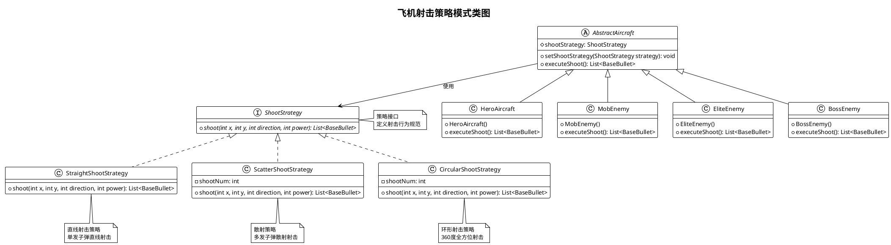
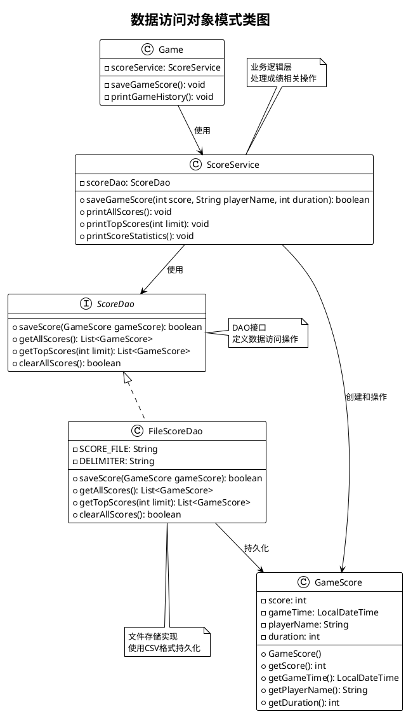
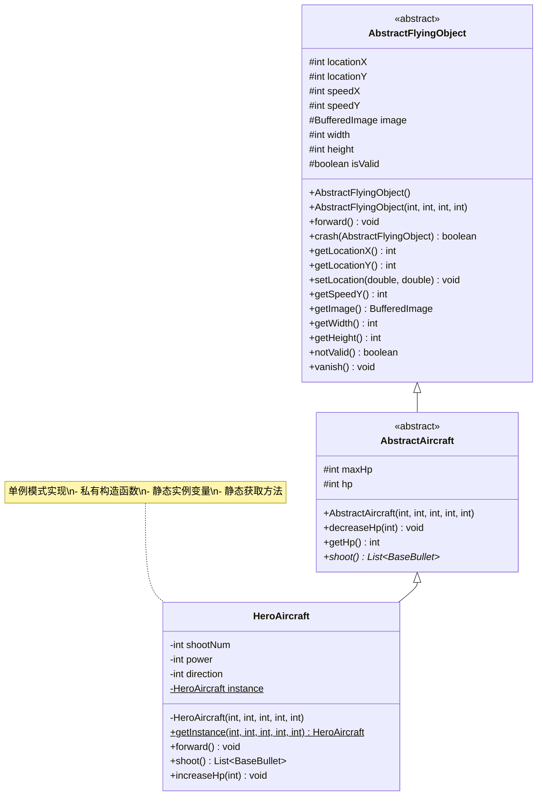
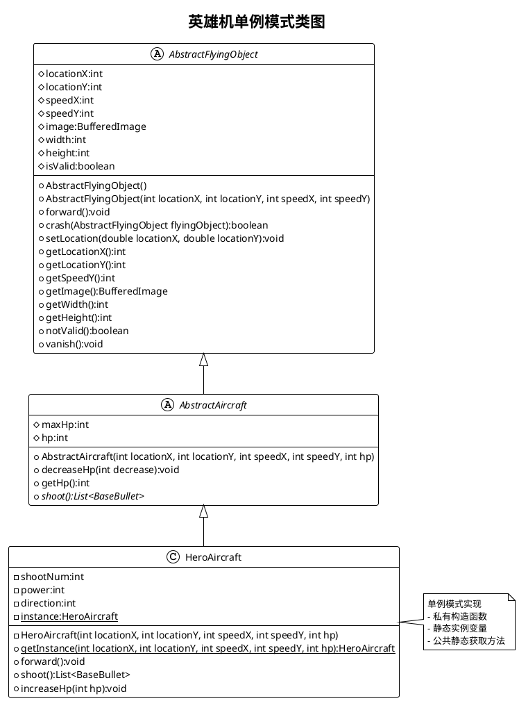
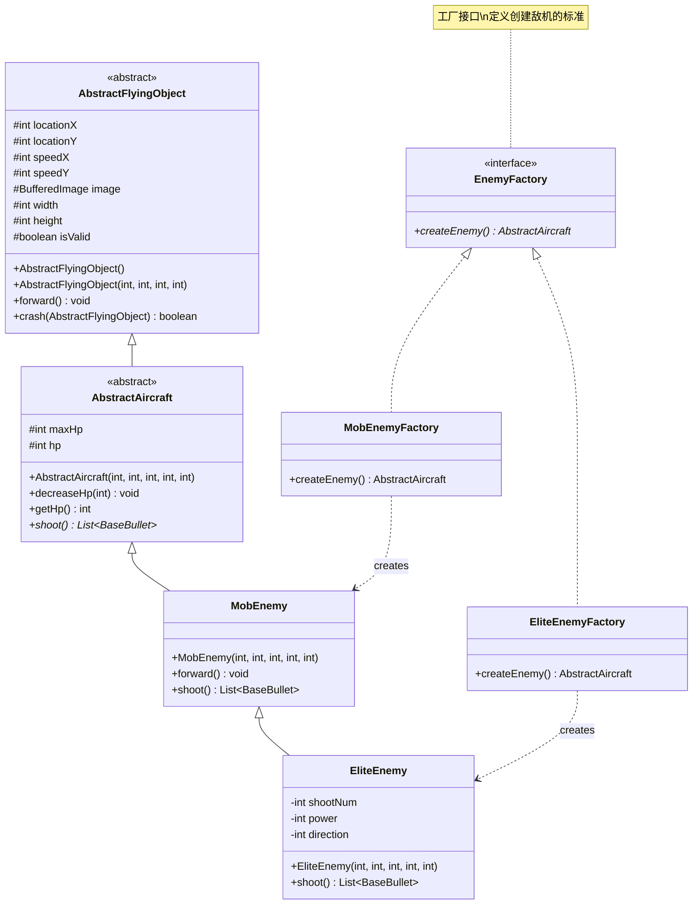
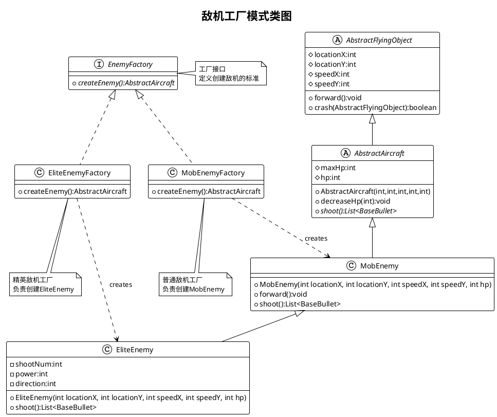
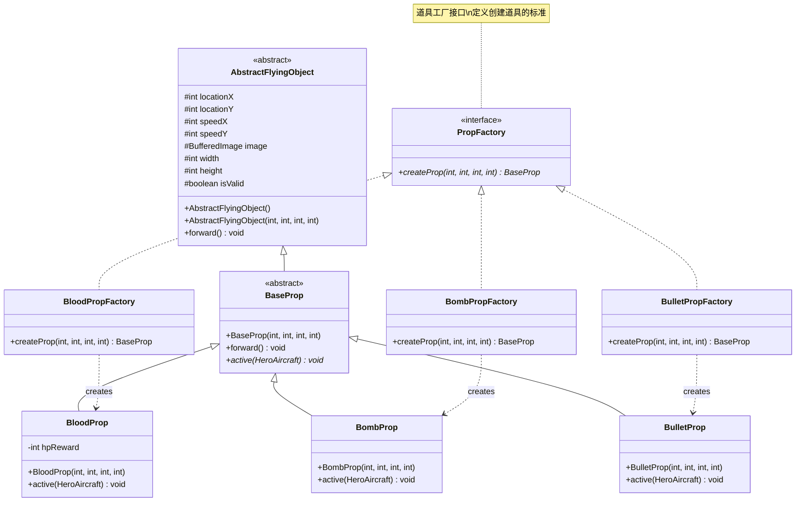
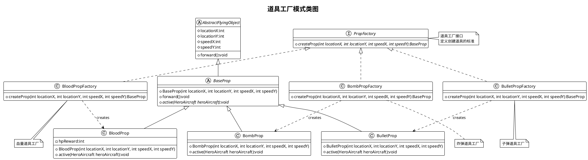

# AircraftWar

## Android Migration (WIP)

- New Android modules: `app` + `game-core` with Java 17 and deterministic core tick engine.
- Implemented screens and flow: `Launcher -> Menu -> Game -> GameOver -> Leaderboard`.
- Added Android rendering loop (`SurfaceView`), touch target input, HUD overlay, and audio manager facade.
- Added CSV-based score persistence for Android app files directory.
- Added parity checklist: `docs/android/parity-checklist.md` and core parity test `GameplayParityTest`.
- Build note: Android app tasks require local SDK setup (`ANDROID_HOME` or `local.properties`).

## 项目概述

飞机大战游戏采用面向对象设计，实现了多种设计模式来提升代码的可维护性和可扩展性。主要包含以下设计模式：

- **单例模式**：英雄飞机的唯一实例管理
- **工厂模式**：敌机和道具的创建管理
- **策略模式**：飞机射击行为的动态切换
- **DAO模式**：游戏成绩的数据持久化

## 新增功能

### 策略模式射击系统
- **直线射击**：普通单发射击，适用于英雄飞机和普通敌机
- **散射射击**：多发子弹散射，增强精英敌机火力
- **环形射击**：360度全方位射击，Boss敌机专用
- **动态切换**：通过道具可临时改变英雄飞机射击模式

### 成绩持久化系统
- **数据存储**：CSV格式文件存储游戏成绩
- **排行榜**：支持按分数排序的排行榜显示
- **历史记录**：完整的游戏历史记录查询
- **统计功能**：成绩统计和分析功能

### 超级子弹道具
- **环形射击道具**：获得后英雄飞机临时获得360度射击能力
- **时效限制**：道具效果持续一定时间后恢复原始射击模式

## 技术特点

- **Java 8+ 特性**：Stream API、Lambda表达式、LocalDateTime
- **设计模式应用**：多种设计模式的综合运用
- **文件I/O处理**：CSV格式的数据持久化机制
- **异常处理**：完善的异常处理和资源管理

## 项目类图

## 项目类图

### 新增设计模式

#### 4. 策略模式类图

采用策略模式重构飞机射击系统，实现射击行为的动态切换。

#### 5. DAO模式类图

实现数据访问对象模式，提供游戏成绩的持久化功能。

### 原有设计模式

#### 1. 英雄机单例模式类图

#### Mermaid 类图

#### PlantUML 类图

---

#### 2. 敌机工厂模式类图

#### Mermaid 类图

#### PlantUML 类图

---

#### 3. 道具工厂模式类图

#### Mermaid 类图

#### PlantUML 类图

