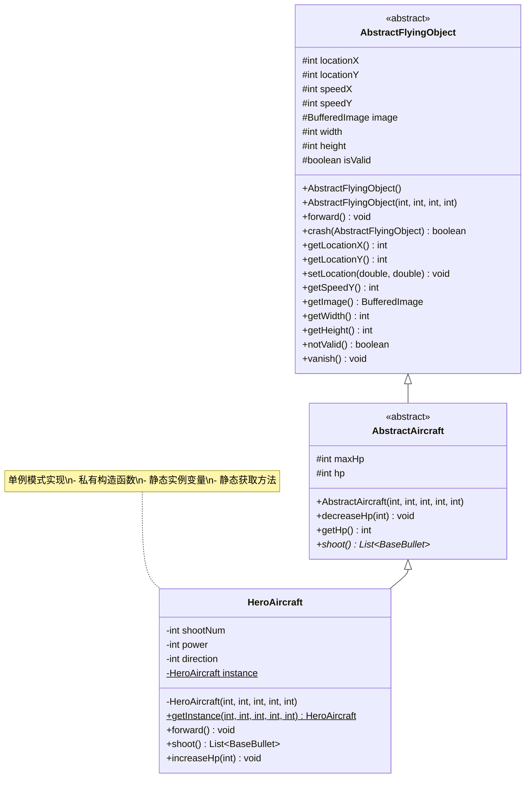
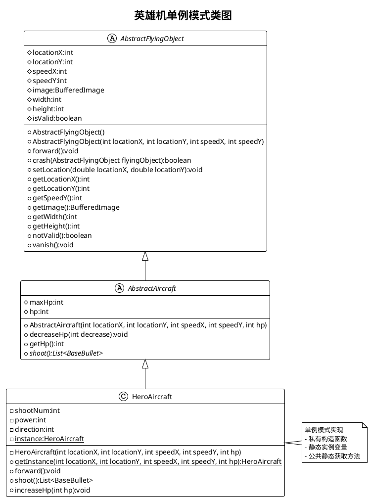
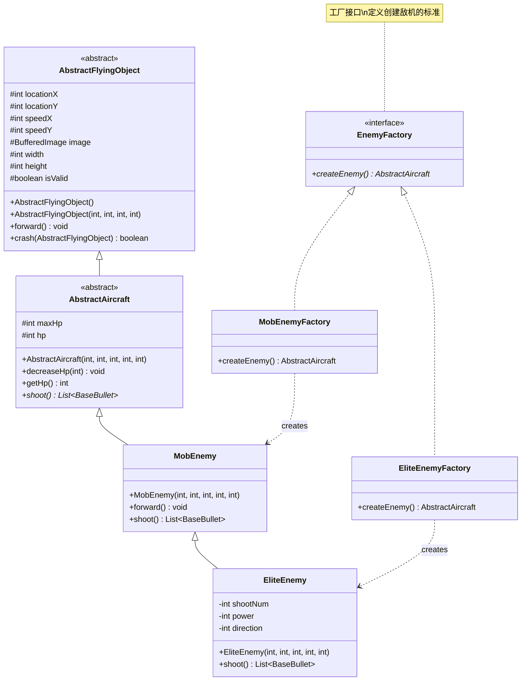
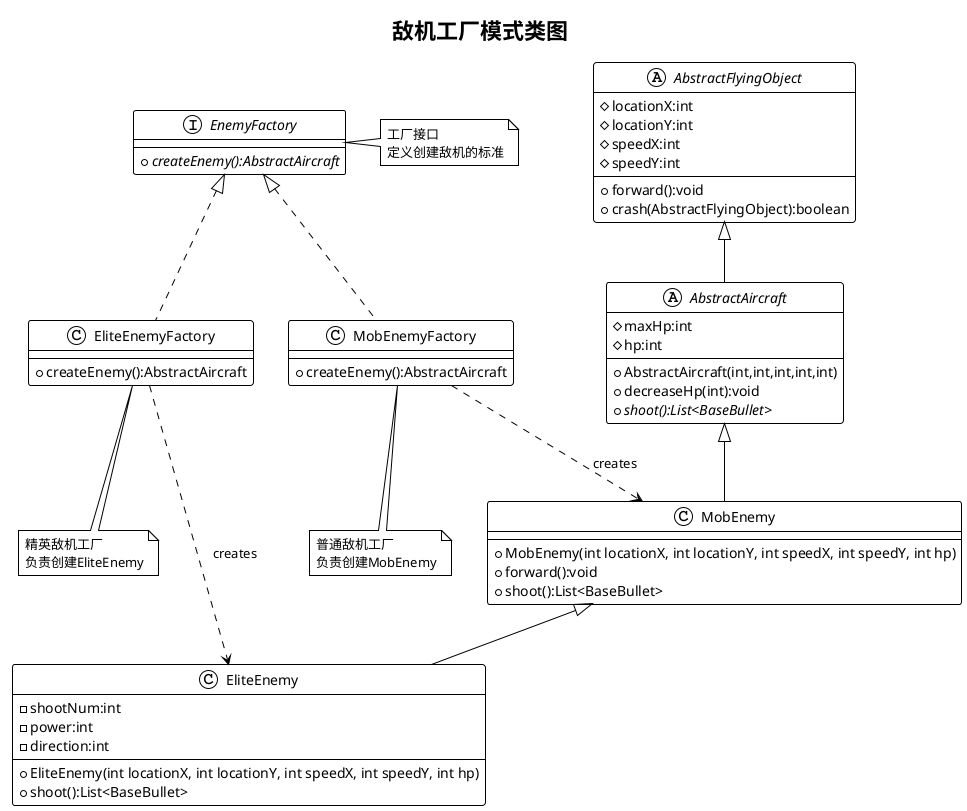
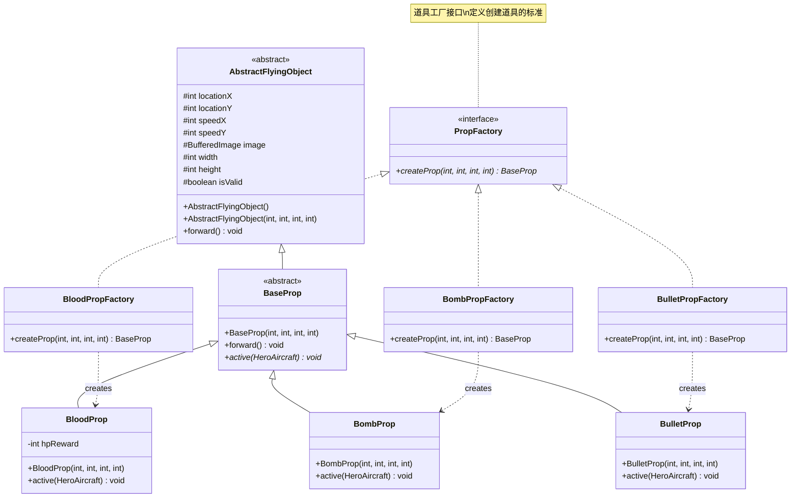
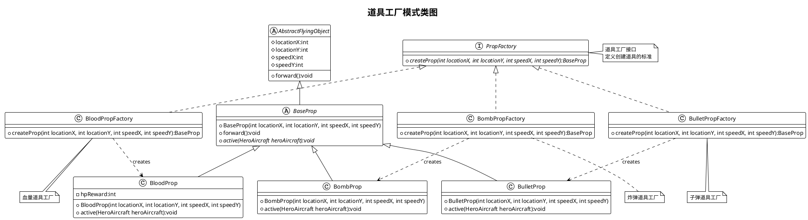

# AircraftWar

## 项目类图

### 1. 英雄机单例模式类图

#### Mermaid 类图

```mermaid
classDiagram
    class AbstractFlyingObject {
        <<abstract>>
        #int locationX
        #int locationY
        #int speedX
        #int speedY
        #BufferedImage image
        #int width
        #int height
        #boolean isValid
        +AbstractFlyingObject()
        +AbstractFlyingObject(int, int, int, int)
        +forward() void
        +crash(AbstractFlyingObject) boolean
        +getLocationX() int
        +getLocationY() int
        +setLocation(double, double) void
        +getSpeedY() int
        +getImage() BufferedImage
        +getWidth() int
        +getHeight() int
        +notValid() boolean
        +vanish() void
    }

    class AbstractAircraft {
        <<abstract>>
        #int maxHp
        #int hp
        +AbstractAircraft(int, int, int, int, int)
        +decreaseHp(int) void
        +getHp() int
        +shoot() List~BaseBullet~*
    }

    class HeroAircraft {
        -int shootNum
        -int power
        -int direction
        -HeroAircraft instance$
        -HeroAircraft(int, int, int, int, int)
        +getInstance(int, int, int, int, int)$ HeroAircraft
        +forward() void
        +shoot() List~BaseBullet~
        +increaseHp(int) void
    }

    %% 继承关系
    AbstractFlyingObject <|-- AbstractAircraft
    AbstractAircraft <|-- HeroAircraft

    note for HeroAircraft "单例模式实现\n- 私有构造函数\n- 静态实例变量\n- 静态获取方法"
```

#### PlantUML 类图

```plantuml
@startuml
!theme plain
title 英雄机单例模式类图

abstract class AbstractFlyingObject
{
    # locationX:int
    # locationY:int
    # speedX:int
    # speedY:int
    # image:BufferedImage
    # width:int
    # height:int
    # isValid:boolean

    + AbstractFlyingObject()
    + AbstractFlyingObject(int locationX, int locationY, int speedX, int speedY)
    + forward():void
    + crash(AbstractFlyingObject flyingObject):boolean
    + setLocation(double locationX, double locationY):void
    + getLocationX():int
    + getLocationY():int
    + getSpeedY():int
    + getImage():BufferedImage
    + getWidth():int
    + getHeight():int
    + notValid():boolean
    + vanish():void
}

abstract class AbstractAircraft
{
    # maxHp:int
    # hp:int
    + AbstractAircraft(int locationX, int locationY, int speedX, int speedY, int hp)
    + decreaseHp(int decrease):void
    + getHp():int
    + {abstract} shoot():List<BaseBullet>
}

class HeroAircraft {
    - shootNum:int
    - power:int
    - direction:int
    - {static} instance:HeroAircraft
    - HeroAircraft(int locationX, int locationY, int speedX, int speedY, int hp)
    + {static} getInstance(int locationX, int locationY, int speedX, int speedY, int hp):HeroAircraft
    + forward():void
    + shoot():List<BaseBullet>
    + increaseHp(int hp):void
}

AbstractFlyingObject <|-- AbstractAircraft
AbstractAircraft <|-- HeroAircraft

note right of HeroAircraft : 单例模式实现\n- 私有构造函数\n- 静态实例变量\n- 公共静态获取方法

@enduml
```

---

### 2. 敌机工厂模式类图

#### Mermaid 类图

```mermaid
classDiagram
    class AbstractFlyingObject {
        <<abstract>>
        #int locationX
        #int locationY
        #int speedX
        #int speedY
        #BufferedImage image
        #int width
        #int height
        #boolean isValid
        +AbstractFlyingObject()
        +AbstractFlyingObject(int, int, int, int)
        +forward() void
        +crash(AbstractFlyingObject) boolean
    }

    class AbstractAircraft {
        <<abstract>>
        #int maxHp
        #int hp
        +AbstractAircraft(int, int, int, int, int)
        +decreaseHp(int) void
        +getHp() int
        +shoot() List~BaseBullet~*
    }

    class MobEnemy {
        +MobEnemy(int, int, int, int, int)
        +forward() void
        +shoot() List~BaseBullet~
    }

    class EliteEnemy {
        -int shootNum
        -int power
        -int direction
        +EliteEnemy(int, int, int, int, int)
        +shoot() List~BaseBullet~
    }

    class EnemyFactory {
        <<interface>>
        +createEnemy() AbstractAircraft*
    }

    class MobEnemyFactory {
        +createEnemy() AbstractAircraft
    }

    class EliteEnemyFactory {
        +createEnemy() AbstractAircraft
    }

    %% 继承关系
    AbstractFlyingObject <|-- AbstractAircraft
    AbstractAircraft <|-- MobEnemy
    MobEnemy <|-- EliteEnemy

    %% 工厂模式关系
    EnemyFactory <|.. MobEnemyFactory
    EnemyFactory <|.. EliteEnemyFactory

    %% 依赖关系
    MobEnemyFactory ..> MobEnemy : creates
    EliteEnemyFactory ..> EliteEnemy : creates

    note for EnemyFactory "工厂接口\n定义创建敌机的标准"
```

#### PlantUML 类图

```plantuml
@startuml
!theme plain
title 敌机工厂模式类图

abstract class AbstractFlyingObject {
    # locationX:int
    # locationY:int
    # speedX:int
    # speedY:int
    + forward():void
    + crash(AbstractFlyingObject):boolean
}

abstract class AbstractAircraft {
    # maxHp:int
    # hp:int
    + AbstractAircraft(int,int,int,int,int)
    + decreaseHp(int):void
    + {abstract} shoot():List<BaseBullet>
}

class MobEnemy {
    + MobEnemy(int locationX, int locationY, int speedX, int speedY, int hp)
    + forward():void
    + shoot():List<BaseBullet>
}

class EliteEnemy {
    - shootNum:int
    - power:int
    - direction:int
    + EliteEnemy(int locationX, int locationY, int speedX, int speedY, int hp)
    + shoot():List<BaseBullet>
}

interface EnemyFactory {
    + {abstract} createEnemy():AbstractAircraft
}

class MobEnemyFactory {
    + createEnemy():AbstractAircraft
}

class EliteEnemyFactory {
    + createEnemy():AbstractAircraft
}

AbstractFlyingObject <|-- AbstractAircraft
AbstractAircraft <|-- MobEnemy
MobEnemy <|-- EliteEnemy

EnemyFactory <|.. MobEnemyFactory
EnemyFactory <|.. EliteEnemyFactory

MobEnemyFactory ..> MobEnemy : creates
EliteEnemyFactory ..> EliteEnemy : creates

note right of EnemyFactory : 工厂接口\n定义创建敌机的标准
note bottom of MobEnemyFactory : 普通敌机工厂\n负责创建MobEnemy
note bottom of EliteEnemyFactory : 精英敌机工厂\n负责创建EliteEnemy

@enduml
```

---

### 3. 道具工厂模式类图

#### Mermaid 类图

```mermaid
classDiagram
    class AbstractFlyingObject {
        <<abstract>>
        #int locationX
        #int locationY
        #int speedX
        #int speedY
        #BufferedImage image
        #int width
        #int height
        #boolean isValid
        +AbstractFlyingObject()
        +AbstractFlyingObject(int, int, int, int)
        +forward() void
    }

    class BaseProp {
        <<abstract>>
        +BaseProp(int, int, int, int)
        +forward() void
        +active(HeroAircraft) void*
    }

    class BloodProp {
        -int hpReward
        +BloodProp(int, int, int, int)
        +active(HeroAircraft) void
    }

    class BombProp {
        +BombProp(int, int, int, int)
        +active(HeroAircraft) void
    }

    class BulletProp {
        +BulletProp(int, int, int, int)
        +active(HeroAircraft) void
    }

    class PropFactory {
        <<interface>>
        +createProp(int, int, int, int) BaseProp*
    }

    class BloodPropFactory {
        +createProp(int, int, int, int) BaseProp
    }

    class BombPropFactory {
        +createProp(int, int, int, int) BaseProp
    }

    class BulletPropFactory {
        +createProp(int, int, int, int) BaseProp
    }

    %% 继承关系
    AbstractFlyingObject <|-- BaseProp
    BaseProp <|-- BloodProp
    BaseProp <|-- BombProp
    BaseProp <|-- BulletProp

    %% 工厂模式关系
    PropFactory <|.. BloodPropFactory
    PropFactory <|.. BombPropFactory
    PropFactory <|.. BulletPropFactory

    %% 依赖关系
    BloodPropFactory ..> BloodProp : creates
    BombPropFactory ..> BombProp : creates
    BulletPropFactory ..> BulletProp : creates

    note for PropFactory "道具工厂接口\n定义创建道具的标准"
```

#### PlantUML 类图

```plantuml
@startuml
!theme plain
title 道具工厂模式类图

abstract class AbstractFlyingObject {
    # locationX:int
    # locationY:int
    # speedX:int
    # speedY:int
    + forward():void
}

abstract class BaseProp
{
    + BaseProp(int locationX, int locationY, int speedX, int speedY)
    + forward():void
    + {abstract} active(HeroAircraft heroAircraft):void
}

class BloodProp {
    - hpReward:int
    + BloodProp(int locationX, int locationY, int speedX, int speedY)
    + active(HeroAircraft heroAircraft):void
}

class BombProp {
    + BombProp(int locationX, int locationY, int speedX, int speedY)
    + active(HeroAircraft heroAircraft):void
}

class BulletProp {
    + BulletProp(int locationX, int locationY, int speedX, int speedY)
    + active(HeroAircraft heroAircraft):void
}

interface PropFactory {
    + {abstract} createProp(int locationX, int locationY, int speedX, int speedY):BaseProp
}

class BloodPropFactory {
    + createProp(int locationX, int locationY, int speedX, int speedY):BaseProp
}

class BombPropFactory {
    + createProp(int locationX, int locationY, int speedX, int speedY):BaseProp
}

class BulletPropFactory {
    + createProp(int locationX, int locationY, int speedX, int speedY):BaseProp
}

AbstractFlyingObject <|-- BaseProp
BaseProp <|-- BloodProp
BaseProp <|-- BombProp
BaseProp <|-- BulletProp

PropFactory <|.. BloodPropFactory
PropFactory <|.. BombPropFactory
PropFactory <|.. BulletPropFactory

BloodPropFactory ..> BloodProp : creates
BombPropFactory ..> BombProp : creates
BulletPropFactory ..> BulletProp : creates

note right of PropFactory : 道具工厂接口\n定义创建道具的标准
note bottom of BloodPropFactory : 血量道具工厂
note bottom of BombPropFactory : 炸弹道具工厂
note bottom of BulletPropFactory : 子弹道具工厂

@enduml
```
